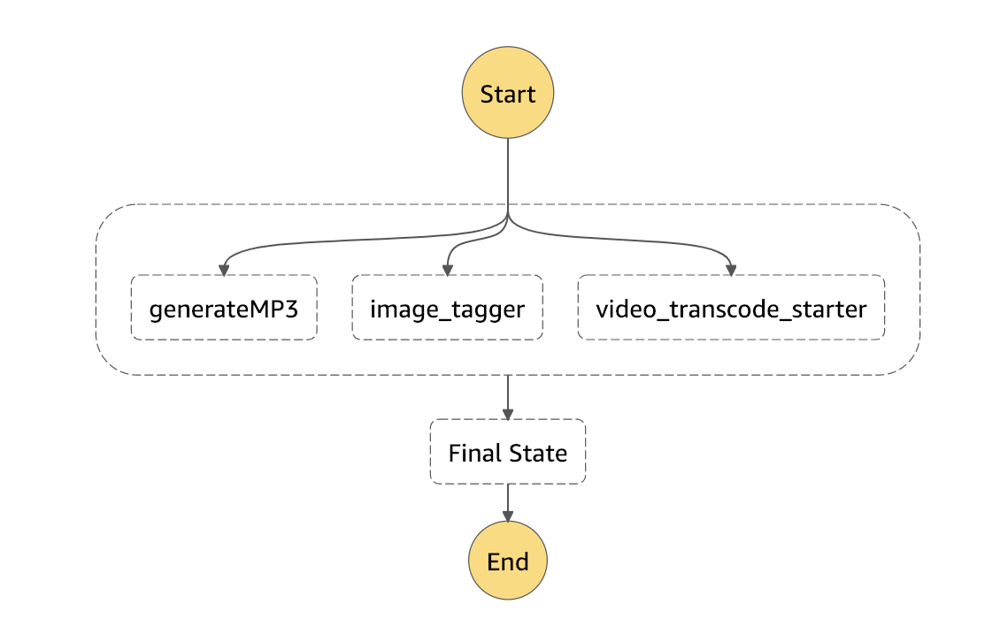

# TBA21-helpers
processing scripts for TBA21:
* Transcode video to different video formats for AWS CloudFront streaming by copying to another s3 bucket to trigger [step function](https://github.com/AcrossTheCloud/video-on-demand-on-aws) for using Elastic Transcoder in a fault tolerant way.
* Transcode video and audio to Amazon Alexa ready audio files.
* Use AWS Rekognition to put image tags in AWS DynamoDB.
* Store file hashes.
* Store image hashes for image files.

## Step diagram

## Included code
[dcraw](src/drcraw.c) by Dave Coffin from [http://www.cybercom.net/~dcoffin/dcraw/](http://www.cybercom.net/~dcoffin/dcraw/).