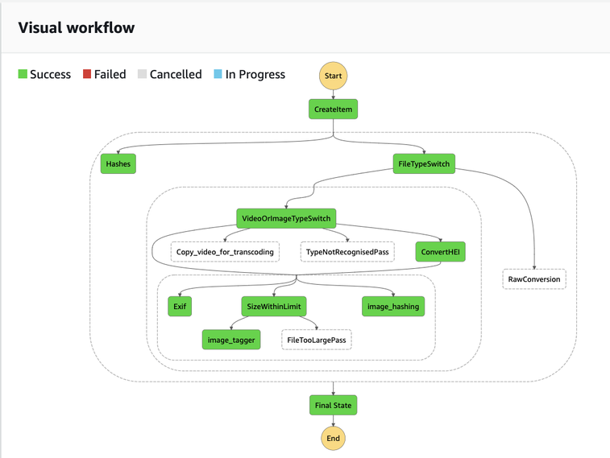

# TBA21-helpers
processing scripts for TBA21:
* Transcode video to different video formats for AWS CloudFront streaming by copying to another s3 bucket to trigger [step function](https://github.com/AcrossTheCloud/video-on-demand-on-aws) for using Elastic Transcoder in a fault tolerant way.
* Transcode video and audio to Amazon Alexa ready audio files.
* Use AWS Rekognition to put image tags in AWS DynamoDB.
* Store file hashes, and (for image files) image hashes, which can aid in duplicate detection.
* Extract [Exif image metadata](https://en.wikipedia.org/wiki/Exif) such as focal length, exposure, geolocation, etc. from image files and store in AWS DynamoDB.
* RAW image conversion to JPG.

## Step diagram

## Included code
* [dcraw](src/drcraw.c) by Dave Coffin from [http://www.cybercom.net/~dcoffin/dcraw/](http://www.cybercom.net/~dcoffin/dcraw/).
* [exiftool](src/exiftool) by Phil Harvey from [https://sno.phy.queensu.ca/~phil/exiftool/](https://sno.phy.queensu.ca/~phil/exiftool/) under [Perl licence](http://dev.perl.org/licenses/)
* [cjpeg](jpeg-9c) jpeg tools from the [JPEG Club](http://jpegclub.org/)
